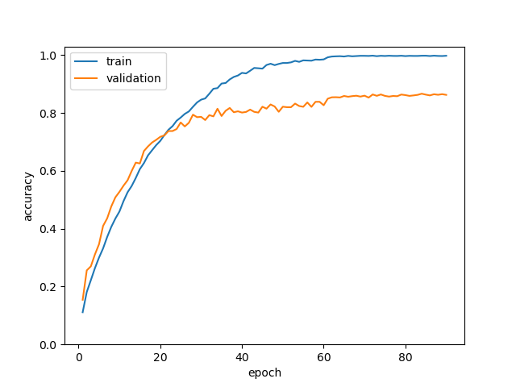
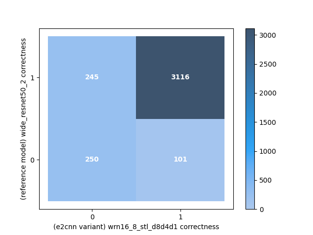
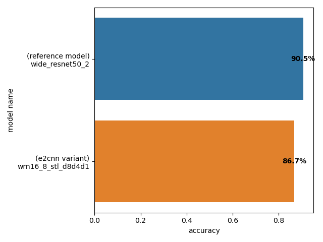
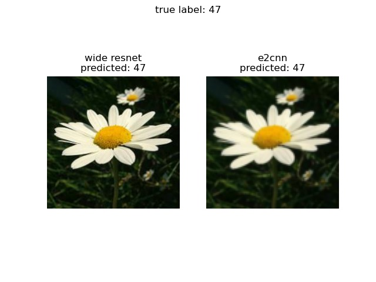
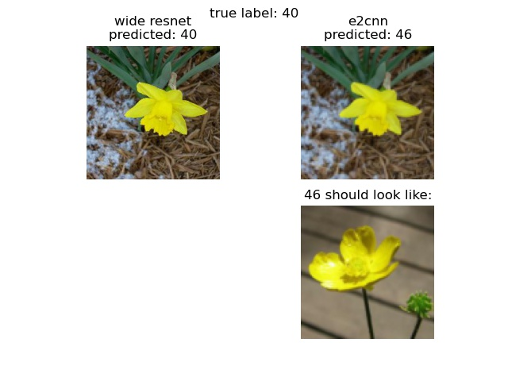
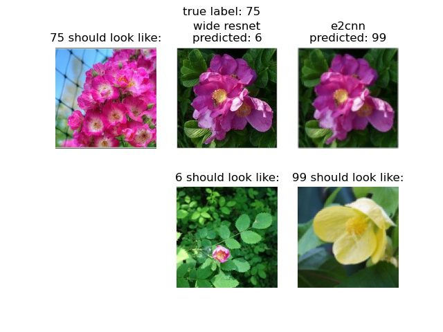
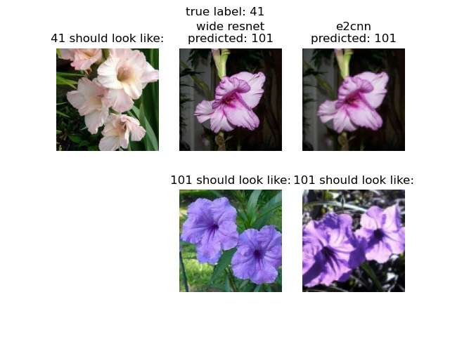
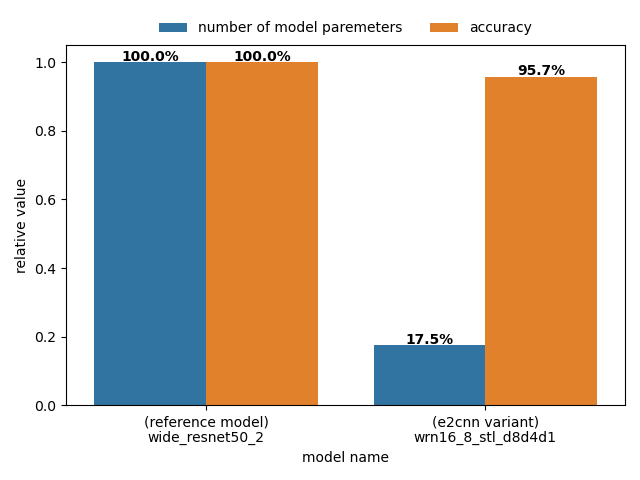

# petals-to-the-metal
A rotationally symmetric/equivariant ConvNet applied to a real world dataset.
## Prologue
**Symmetry** is a term adored by physicists, meaning that one does something to a system while the result stays apparently the same. In the machine learning community, a more precise term, **equivariance**, is used, which means when one does something to a system, the result changes *accordingly*. From now on, I will follow the machine learning jargons.

Convolutional Neural Networks (CNN) are by construction translationally equivariant. CNNs use filters that are spacially small compared to a whole image and slide filters over an image to identify local features. No matter where an eye appears in an image, it is eventually picked up by filters through scanning.

On the other hand, rotational equivariance is not built into CNN's mathematical framework. The consequence is, for example, a lower accuracy in identifying upside down cats. To address the issue caused by object orientations, images are rotated by random angles before they are fed to train the neural nets. This is a kind of *data augmentation*.

It is aesthetically enticing to construct CNNs with rotational equivariance built into their mathematical framework. Rotational equivariance imposes constraints on the size of the function space of filters. This potentially can improve the performance or parameter efficiency of neural networks, just like weight sharing greatly reduced the model complexity and took part in the breakthrough of superhuman performance.

A large amount of papers have been published about the construction of a rotationally equivariant CNN. The variant I am testing out in this repository is [e2cnn](https://github.com/QUVA-Lab/e2cnn).
## A rotationally equivariant CNN, E(2)-steerable CNN
[Amsterdam Machine Learning Lab](https://amlab.science.uva.nl/), a group led by [Prof. Max Welling](https://staff.fnwi.uva.nl/m.welling/), has been applying group theory to the mathematical framework of neural networks for years with impactful publications.

It is anecdotally interesting to note that Prof. Welling got his PhD degree under the instruction of Prof. Gerard 't Hooft, a renowned theoretical physicist who proved the renormalizability of gauge theories in his PhD work and received the Nobel Prize in Physics with it in 1999.

The theory behind equavariance is profound. One of the major contributions of the authors' work is to derive and solve the so-called *kernel constraints* that all general steerable CNNs have to obey. For details in the theory, refer to the original paper. [[1]](#1)

## Data used for this investigation
The data used for this investigation comes from one of the Kaggle competitions called [Petals to the Metal - Flower Classification on TPU](https://www.kaggle.com/c/tpu-getting-started). This dataset is selected simply because the competition has no end date. Therefore, I can be sure that the dataset will be available for a long time. Besides, due to the radial symmetry of flowers, this might exhibit some interesting effects on the results.
### Data format conversion
The data is provided by Kaggle in the TFRecord format readily used by TensorFlow. However, since I am using PyTorch for this study, I have to convert the TFRecord files into the input data format PyTorch uses. To achieve this, I have written a simple script which can be found in [this repository](https://github.com/kaikai581/tfrecord-io-test).

The original TFRecord files can be downloaded from [this link](https://storage.googleapis.com/kaggle-competitions-data/kaggle-v2/21154/1243559/bundle/archive.zip?GoogleAccessId=web-data@kaggle-161607.iam.gserviceaccount.com&Expires=1614893308&Signature=Q%2FHtFG2qA6ITd1mFpWFnCFbJrpyKWCzcgqLpfGk3AK063ZgPNtbRbIe6yB6JG8g%2BN%2FDLQ%2BzgoTfg81%2BpZkXDHjNp7d41EuXwY1dMwnBNnPSBD26zJhbaV%2Fr%2FDCUiLHhBKM%2BhXZwi1cV35TJM1L4KmQi77gTCUBKV86nU6k%2B5AaqZ6eb5bQtk95dPORleoYUD3p4KPtE3gcG93ij2rTDWA8cCC%2B39jFgz4XLEoFy34%2FpCy9KIVnp1waDSCSULylIxnYki4OktGLEGsOueTxUR3ruaTKsnrS17T%2F1Au4pvm%2FUzctx1B6jIoHoyMl1sc37nHGsQq9R5%2FbpQkf9S%2BYDzTg%3D%3D&response-content-disposition=attachment%3B+filename%3Dtpu-getting-started.zip). After data conversion, one should see a directory tree structure like this.
```
$ tree imagefolder-jpeg-224x224 -L 1
imagefolder-jpeg-224x224
├── test
├── train
└── val
```
For convenience, the converted images can be downloaded from [here](https://www.kaggle.com/shihkailin/imagefolderjpeg224x224/download).

## Install e2cnn in an Anaconda environment with GPU acceleration
[Anaconda](https://www.anaconda.com/) has been my choice of python distribution for all projects. Follow the [instruction](https://docs.anaconda.com/anaconda/install/) to install Anaconda on your system, and make sure that the `conda` command is available to your command line.

To install e2cnn to your Anaconda environment, first create an environment.
```
$ conda create -n <env_name>
$ conda activate <env_name>
```
Now, install PyTorch that is compatible to your GPU driver installed. To make sure the compatibility, use the `nvidia-smi` command. For example, on my system,
```
$ nvidia-smi
Thu Mar  4 15:34:31 2021       
+-----------------------------------------------------------------------------+
| NVIDIA-SMI 418.87.00    Driver Version: 418.87.00    CUDA Version: 10.1     |
|-------------------------------+----------------------+----------------------+
| GPU  Name        Persistence-M| Bus-Id        Disp.A | Volatile Uncorr. ECC |
| Fan  Temp  Perf  Pwr:Usage/Cap|         Memory-Usage | GPU-Util  Compute M. |
|===============================+======================+======================|
|   0  GeForce GTX 108...  Off  | 00000000:65:00.0 Off |                  N/A |
| 25%   27C    P8    11W / 250W |      0MiB / 11178MiB |      0%      Default |
+-------------------------------+----------------------+----------------------+

+-----------------------------------------------------------------------------+
| Processes:                                                       GPU Memory |
|  GPU       PID   Type   Process name                             Usage      |
|=============================================================================|
|  No running processes found                                                 |
+-----------------------------------------------------------------------------+
```
In the top right corner, the CUDA Version listed is 10.1. Since CUDA toolkit is backward compatible, <span style="color:green">all PyTorch versions earlier than 10.1 would work</span>. Therefore, I would install cudatoolkit 10.1 as an example. Look up the correct command on the [PyTorch front page](https://pytorch.org/).
```
$ conda install pytorch torchvision cudatoolkit=10.1 -c pytorch
```
Finally, it's time to install e2cnn into the current environment.
```
$ pip install e2cnn
```

## Models used in this study
Since e2cnn is more like a mathematical framework, the author has provided several predefined variants for easy use. I have tried some of them, and found the variant, `wrn16_8_stl_d8d4d1`, to be very performant.

A brief explanation on the model name. "wrn" is "wide ResNet", suggesting the network structure is modeled after this CNN architecture, 16 is the depth, 8 is the so-called "widen factor", "stl" means the model is built for the STL dataset, and d8d4d1 means that the model's blocks are respectively [D₈, D₄ and D₁](https://en.wikipedia.org/wiki/Dihedral_group) equivariant.

Find [here](https://github.com/kaikai581/petals-to-the-metal/blob/master/train_models/wrn16_8_stl_d8d4d1_weight_decay/train_model.py) for the script I use to train the model. The trained weights used in this study can be downloaded [here](https://drive.google.com/file/d/1lwMc9DizSwmD0TEXbuqIY2xUBGCqIeVM/view?usp=sharing).

To get ideas about how the chosen model performs, a <span style="color:magenta">performance baseline</span> is required. Due to the architectural similarity and ready availability with `torchvision`, [wide_resnet50_2](https://pytorch.org/hub/pytorch_vision_wide_resnet/) seems to be a natural choice as the baseline performance measure. For a quick start, I employ PyTorch's [transfer learning](https://pytorch.org/tutorials/beginner/transfer_learning_tutorial.html) to retrain only the fully connected layer to adapt to the number of flower classes in this dataset.

Find [here](https://github.com/kaikai581/petals-to-the-metal/blob/master/train_models/wide-resnet/no-augmentation/transfer_learning.py) for the script I use to perform transfer learning. The baseline model weights used in this study can be downloaded [here](https://drive.google.com/file/d/1FQoz-n5GbcM2c00esyyDQqIuMrMFla3a/view?usp=sharing).

### Data augmentation and preprocessing
With both models, I have applied random horizontal flip and data standardization. I have left out random rotation on purpose in the hope of giving the e2cnn model an edge.

For the baseline model, images of the original size, 224x224, are used. Meanwhile, for the e2cnn model, images are shrunk to <span style="color:red">96x96</span> to speed up the computing time. To be specific, the e2cnn training times are 63 minutes and 13.3 minutes per epoch with 224x224 and 96x96, respectively.

## Learning curves
Learning curves can not only show how the models learn but they are, in my opinion, beautiful to stare at.
Here I am showing the learning curves for both models and trying to understand what happens to the learning processes.

### Learning curve for the baseline model
Here is the learning curve for the baseline model.
<p align="center" width="100%">
    
</p>

After 10 epochs, the train and validation accuracies don't change anymore. The performance converges extremely fast within 10 epochs. This indicates that training only the fully-connected layer for 104 classes is straightforward since all knowledge on low-level features is carried over from pre-training on ImageNet.

### Learning cure for the e2cnn model
Here is the learning curve for the baseline model.
<p align="center" width="100%">
    
</p>

The model is trained from scratch, so the learning curve starts with accuracies close to zero. After 20 epochs, the accuracy increase starts to slow down dramatically. After 80 epochs, the accuracy gain per epoch is so small that I decide to stop at epoch 90.

In contrast with a [zoo of learning curves](https://www.baeldung.com/cs/learning-curve-ml), the feature that both train and validation accuracies saturate and being constant with a large gap over epochs could mean that I am suffering from an unrepresentative training dataset.

## Performance comparison
Inspired by confusion matrices, a "correctness matrix" can be constructed here, in which the four matrix elements mean "both models predict correctly", "only one of them is correct", and "both are wrong". The z-values indicate how many validation images belong to the respective matrix elements.

Here is the correctness matrix for this investigation.
<p align="center" width="100%">
    
</p>

From the matrix, 83.94% of the validation images are recognized correctly by both models, which I think is a very impressive result.

As for the individual model performance, the reference model still has a slightly higher performance, as can be seen in the following figure.
<p align="center" width="100%">
    
</p>

Let's take a look at some examples from each quadrant.

### Examples from quadrant I
Below is an example image whose class is predicted correctly by both models.
<p align="center" width="100%">
    
</p>

Note that the image input to e2cnn looks blurrier due to downsampling from 224x224 to 96x96.

### Examples from quadrant II
Below is an example image whose class is predicted correctly only by the reference model.
<p align="center" width="100%">
    
</p>

Some of the images are actually hard for humans as well.

### Examples from quadrant III
Here I am showing images whose class is predicted incorrectly by both models.
Below is one with different predicted labels by the models.
<p align="center" width="100%">
    
</p>

Images in the top row are of the same class. Again, sometimes one finds that even humans cannot do a good job.

More interestingly, there are images that both models predict the same wrong class. Here is one example.
<p align="center" width="100%">
    
</p>

I don't blame the neural networks.

### Examples from quadrant II
Below is an example image whose class is predicted correctly only by the e2cnn model.
<p align="center" width="100%">
    
</p>

### Potential reasons for worse accuracy
There are at least two obvious reasons that potentially contribute to the worse accuracy seen with the e2cnn model.

1. The pre-trained models provided by `torchvision` are trained on ImageNet, which contains more than ten million images. On the other hand, the test model is trained from scratch on only 12753 images.
2. Since for the reference model, only the fully connected layer is retrained, full image resolution of 224x224 can be used without exceedingly long time to train. However, for the test model, since all weights are trained from scratch, plus certain computing overhead from steerable filters, 224x224 resolution takes unacceptably long time. As a result, each image is down sampled to 96x96, which might worsen the accuracy.

### Potential means to improve accuracy
Below are means that could potentially improve the test model performance but have not been tried out.

1. It is doable to train the test model on ImageNet and retrain only the fully connected layer subsequently. If the lower accuracy is partly due to unrepresentative training data, this could help.
2. It could be interesting to see if [super-convergence](https://arxiv.org/abs/1708.07120) works in this particular setting.

### Model efficiency
It's only when one examines the model size does one realize the potential power of equivariant networks.
Here is the comparison of the number of model parameters.
<p align="center" width="100%">
    
</p>

If both metrics, accuracy and model size, are plotted at the same time in a relative scale, e2cnn's strength in efficiency can be more clearly seen.
<p align="center" width="100%">
    
</p>

Here, e2cnn uses only 18% of model parameters to achieve accuracy merely 4% shy of that of a traditional CNN.

## Summary
Rotationally equavariant CNN endows CNN's mathematical framework with rotation symmetry. As this study shows, by restricting filters' accessible function space, model efficiency is greatly improved.

There are still room to improve the accuracy obtained in this study. Another topic that could be of interest is to see whether e2cnn is more resistant to [adversarial rotations](https://arxiv.org/abs/1802.06627). These could all serve as the future studies.

## References
<a id="1">[1]</a>
Weiler, Maurice and Cesa, Gabriele (2019).
General E(2)-Equivariant Steerable CNNs.
*Conference on Neural Information Processing Systems (NeurIPS)*.
